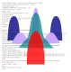

# [QcmP Lab](https://github.com/QcmPlab) - LOGO 
 

## Stable versions

Here you have the latest stable version (for now in two flavours: dark and light background). This is what you should use.  
You can download the raster (.png) render [here](https://github.com/QcmPlab/LOGO/releases), in the **Assets** tab under _Latest release_.
> So, everytime we change these files, we should release the corresponding raster pictures.

|         `DARK`         |          `LIGHT`         |
| ---------------------- | ------------------------ |
|  |  |

**A note:**  
as you can see looking down at the next table, the current stable version of the `DARK` logo is strongly grounded on the `SLACK` official color-scheme (the logo has been originally intended for our [Slack channel](https://qcmplab.slack.com/)). We just notice that the background color is slightly different, so to better work with the overlayed code and resemble a little the standard ubuntu terminal. 

##  Color-agnostic usage

Having a simple set of 4(+1) elements(+background) it could be a nice idea to make the logo "color-agnostic", meaning that we don't really have a unique set of colors (but maybe indeed a "main" one), and use different case-specific sets. As an example if ever it will exist some repository dedicated to a `julia-language` API for the main `Fortran` libraries it could display a "julia-flavored" version of the logo, using the four colors defined in their [graphical identity](https://github.com/JuliaLang/julia-logo-graphics) docs. Here we give some arbitrary examples, just to showcase the idea: 

 
|                `SLACK`                  |                  `JULIA`                |                     `MICROSOFT`                 |                 `GOOGLE`                  |
| --------------------------------------- | --------------------------------------- | ----------------------------------------------- | ----------------------------------------- |
|  |  |  |  |

> Let's say that, when in need of a specific "branded" logo, we craft it just by changing color-scheme to the basic template and upload the result to the _brand-colors_ folder. If the logo is actually used we upload a raster render as a _release asset_.

Some additional guidelines on the workflow: 
- a very good source of branded color-schemes is [_brandpalettes.com_](https://brandpalettes.com), that also points to the original sources (when available) and has a nice built-in search function. You may want to start from there.
- we aim to keep the .svg files as clean and uniform as possible, so please remember to change alpha values only level-wide, not in the single-element color rgba value; in general please make good use of svg-levels. 

## `TODO`
- [ ] Move away from the slack color palette for the main dark version of the logo; the slack-flavored logo could remain for the [Slack channel](https://qcmplab.slack.com/), but we aim to have a completely original main logo. [updates on the [`dark`](https://github.com/QcmPlab/LOGO/tree/dark) branch] 
- [ ] Make the "MIT-A(w)-curves" from scratch (instead of extracting from the famous Physics Today of Kotliar and Vollhardt); either by getting fresh IPT results (fast but maybe not ideal) or with a simple, neat analytical sketch of the shapes (better?).
- [ ] Maybe have a simple script setting everything up, instead of working by hand on inkscape; so to make easier little changes and updates. [`¡this would totally change the workflow!`]
- [x] Rearrange and rotate the curves to get an "ED" instead of a "Ψ", ~~which may fit better the overall spirit of the codebase~~ [look at [`ED`](https://github.com/QcmPlab/LOGO/tree/ED) branch]
  

<kbd> © 2020 | Gabriele Bellomia 